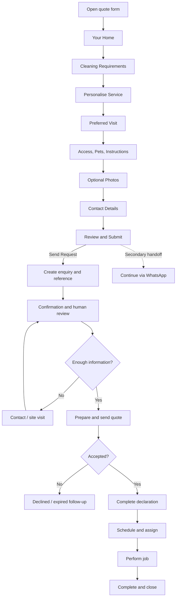
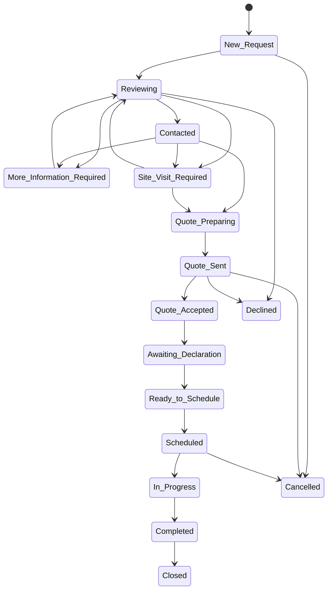
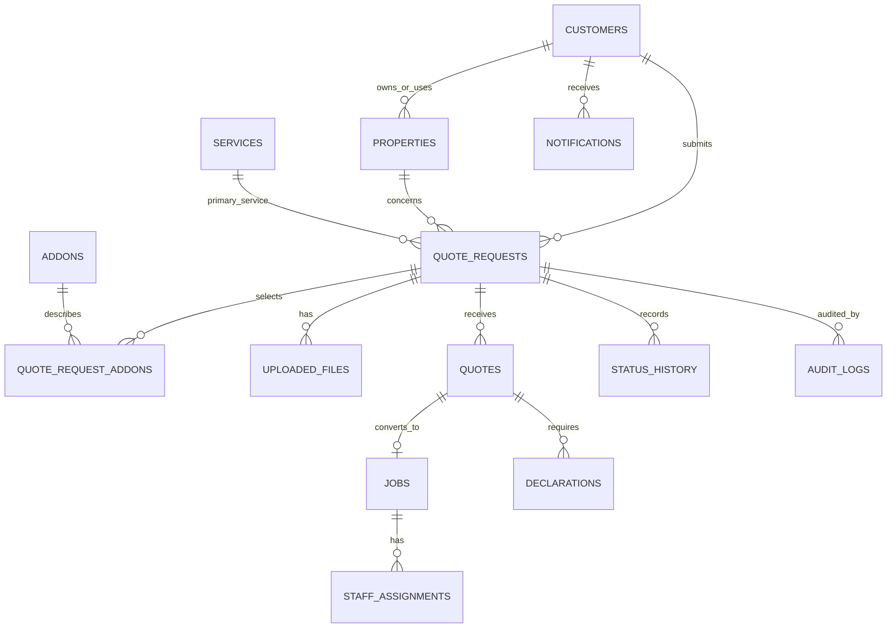

# Hestiva Smart Quote System — Product Specification

**Document status:** Implementation blueprint; no feature is implemented by this document  
**Version:** 1.0  
**Date:** 2 August 2026  
**Business:** Hestiva — *Grace in Every Detail.*  
**Quote contact:** quotes@hestiva.co.za | 068 423 1614  
**General contact:** info@hestiva.co.za  
**Address:** 2962 Dunlin Drive, Riverlea, Johannesburg, 2093

## 1. Executive summary

The Hestiva Smart Quote System will be a mobile-first, eight-step guided request experience for residential cleaning and home care. It will gather enough structured information for a personalised quotation while using progressive disclosure, plain language, autosave, optional photographs, and a live non-price summary to avoid overwhelming customers. **Send Request** is always the primary action. **Continue via WhatsApp** is a secondary handoff and never replaces the structured request.

Each successful submission will ultimately create one enquiry in the rebranded Hestiva area of the Cleaning Marshall OS, issue a human-readable reference, alert Hestiva, and confirm receipt to the customer. No price is calculated in the initial release. After human review, a quote may be issued and accepted; only then does the customer complete the mandatory home-access and valuables declaration. A job cannot be scheduled until that declaration is current and complete.

This specification is deliberately implementation-neutral. Existing backend, database, messaging, storage, and OS capabilities must be discovered during implementation; none are assumed here.

### 1.1 Requirement classification

| Classification | Meaning |
|---|---|
| **Confirmed business requirement (CBR)** | Explicitly required for Hestiva and must be delivered unless formally changed. |
| **Recommended design decision (RDD)** | Proposed implementation detail requiring product/technical confirmation. |
| **Future optional enhancement (FOE)** | Out of initial scope and separately estimated. |
| **Approval required (AR)** | Requires legal, privacy, security, finance, or operational sign-off. |

### 1.2 Confirmed business requirements

- Brand: warm-premium, professional, trustworthy and polished—not exclusive or conspicuously expensive.
- Audience: middle- and upper-middle-income households, professionals, families, and apartment, townhouse, estate, and house residents.
- Eight guided stages; mobile-first; structured submission is primary.
- Submission creates an OS enquiry, reference, internal email and in-app notification, client confirmation, timestamp, and source `Website Quote Form`.
- Optional WhatsApp handoff uses 068 423 1614, excludes valuables detail, and preserves the structured request where possible.
- The first form contains only a declaration notice. The full declaration is mandatory after acceptance and before scheduling.
- No automatic price until a verified pricing engine exists.

### 1.3 Assumptions and constraints (RDD unless approved)

- One request concerns one property and one primary service; add-ons may be many.
- South African dates display as `DD MMM YYYY`, while APIs store ISO 8601 UTC; currency is ZAR.
- Customers need no account for initial submission. Expiring, single-purpose signed links support quote acceptance and declarations.
- A draft is stored locally first and may be synchronised server-side under an opaque draft token after consent.
- Reference format: `HES-Q-YYYYMM-XXXXXX` using a non-sequential, collision-resistant suffix.
- “Every two weeks” is stored as `fortnightly`; addresses use separate structured fields plus a display address.
- Service availability, operating radius/hours, response-time promise, upload retention, quote validity, and recurring-service declaration cadence remain operational decisions.

## 2. Experience principles and customer journey

1. **Open:** Customer enters from a service/location page. The introduction states approximate completion time, that no booking or price is created, privacy purpose, and save/resume behaviour.
2. **Home:** Customer supplies property characteristics and location; irrelevant access questions remain hidden.
3. **Requirements:** Customer selects the primary service, frequency, condition, and areas in scope.
4. **Personalise:** Contextual add-ons appear; plain-language descriptions set expectations.
5. **Preferred visit:** Customer gives two preferences and understands that neither is confirmed.
6. **Access and household:** Only quote-relevant access, pets, restrictions, and safety information is collected; no valuables inventory is requested.
7. **Photos:** Customer optionally categorises and uploads useful images, can retry/remove them, and sees privacy guidance.
8. **Contact:** Customer identifies themselves and selects a contact preference.
9. **Review:** A sectioned, editable review and live summary reveal omissions. The declaration notice and consent are displayed.
10. **Submit:** **Send Request** validates server-side, creates exactly one request and reference, then shows confirmation. Repeat taps reuse the idempotent result.
11. **Confirm/contact:** Customer receives email confirmation. Hestiva reviews, records contact attempts, and requests more information or a site visit if needed.
12. **Quote:** Hestiva prepares and sends a versioned quote with expiry and scope. Customer accepts through a secure link or an authorised staff member records offline acceptance.
13. **Declare:** The customer completes and signs the current declaration. Sensitive details are restricted by role.
14. **Schedule:** Hestiva confirms a slot only when acceptance and declaration gates pass, assigns appropriate staff, and sends booking confirmation.
15. **Deliver/complete:** Staff see only operationally necessary instructions. Status moves through In Progress to Completed; completion evidence and exceptions are recorded before closure.



## 3. Multi-step form and complete field dictionary

**Matrix legend:** Req = required; DB is the proposed logical path; OS/Email/WA use `Y`, `N`, or `C` (conditional). Confirmation email should contain a safe summary, never the full address, access codes, allergy detail, or free-text security instructions. The WhatsApp summary uses only explicitly marked fields.

### Step 1 — Your Home

| Field | Type / options | Req | Helper, validation, conditional rule | DB field | OS | Email | WA |
|---|---|:---:|---|---|:---:|:---:|:---:|
| Property type | Cards: apartment, townhouse, house, duplex | Y | “Choose the closest match.” Enum only. | `properties.property_type` | Y | Y | Y |
| Suburb | Autocomplete + text fallback | Y | 2–80 chars; approved service area warning, not silent rejection. | `properties.suburb` | Y | Y | Y |
| Full service address | Address fields: line 1/2, city, province, postal code | Y | Line 1 3–120; SA postal code 4 digits; precise address is never sent to WA. | `properties.address_*` | Y | N | N |
| Approximate floor size | Number + “Not sure” | N | m², 10–2,000; allow unknown. | `properties.floor_size_sqm` | Y | N | N |
| Bedrooms | Stepper, 0–20 | Y | Include rooms to be cleaned. | `properties.bedroom_count` | Y | Y | Y |
| Bathrooms | Stepper, 0–20 | Y | Include guest toilets as 0.5 via half-bath count if enabled. | `properties.bathroom_count` | Y | Y | Y |
| Living areas | Stepper, 0–10 | Y | Lounges, dining/family rooms. | `properties.living_area_count` | Y | N | N |
| Kitchens | Stepper, 0–5 | Y | Include sculleries only if cleaned as kitchens. | `properties.kitchen_count` | Y | N | N |
| Storeys | Stepper, 1–10 | Y | Apartment = floors inside unit, not building floor. | `properties.storey_count` | Y | N | N |
| Balcony/patio | Toggle; count if yes | Y | Reveals count 1–10. | `properties.has_balcony_patio`, `balcony_patio_count` | Y | N | N |
| Garage | Toggle; bays if yes | Y | Reveals 1–10 bays and later garage-sweep add-on. | `properties.has_garage`, `garage_bays` | Y | N | N |
| Estate or complex | Toggle; name optional | Y | If yes, reveal name and access fields in Step 5. | `properties.is_estate_complex`, `complex_name` | Y | N | N |
| Lift or stair access | Select: ground level, lift, stairs, both, not applicable | C | Required for apartment/complex or multi-storey access. | `properties.access_route` | Y | N | N |
| Parking availability | Select: on-site, street, visitor, paid, none, unsure | Y | “Helps us plan the team’s arrival.” | `properties.parking_type` | Y | N | N |

### Step 2 — Cleaning Requirements

| Field | Type / options | Req | Helper, validation, conditional rule | DB field | OS | Email | WA |
|---|---|:---:|---|---|:---:|:---:|:---:|
| Selected service | Single-select cards: regular home, deep, move-in, move-out, apartment, kitchen, bathroom sanitisation, bedroom, living area, interior window, laundry folding, eco-friendly cleaning | Y | One primary service; recommend a compatible alternative without replacing selection. | `quote_requests.primary_service_id` | Y | Y | Y |
| Areas requested | Multi-select: whole home, kitchen, bathrooms, bedrooms, living areas, windows, other | Y | At least one; “whole home” may select compatible areas. | `quote_request_areas.area_code` | Y | Y | N |
| Frequency | One-time, weekly, every two weeks, monthly, custom | Y | Move services default to one-time but remain editable if operationally allowed. | `quote_requests.frequency` | Y | Y | Y |
| Custom frequency | Short text | C | Required when custom; 3–120 chars. | `quote_requests.frequency_notes` | Y | Y | N |
| Home condition | Light upkeep, standard lived-in, needs extra attention, heavy build-up, recently renovated, vacant, move-in/out condition | Y | Neutral copy: “This helps estimate time and supplies.” | `quote_requests.home_condition` | Y | Y | N |
| Requirement notes | Textarea | N | 1,000 chars; no payment or valuables information prompt. | `quote_requests.requirement_notes` | Y | N | N |

### Step 3 — Personalise Your Service

| Field | Type / options | Req | Helper, validation, conditional rule | DB field | OS | Email | WA |
|---|---|:---:|---|---|:---:|:---:|:---:|
| Add-ons | Multi-select: inside oven, inside fridge, inside cupboards, interior windows, laundry folding, ironing, bed making, linen change, balcony/patio, garage sweep, extra bathroom, extra refrigerator, pet-hair treatment, eco-friendly products, post-renovation dust removal | N | Show only service/property-compatible options; selected values remain visible if an earlier answer changes and require confirmation/removal. | `quote_request_addons.addon_id` | Y | Y | Y |
| Add-on quantity | Stepper | C | Required for countable selected items; 1–10 (windows may use 1–50). | `quote_request_addons.quantity` | Y | N | N |
| Add-on notes | Short text per selection | N | 250 chars each; e.g., appliance size. | `quote_request_addons.notes` | Y | N | N |
| Products supplied by | Radio: Hestiva, customer, discuss | Y | Availability is confirmed during review. | `quote_requests.product_supply_preference` | Y | N | N |

**Conditional recommendations:** balcony/patio requires the property feature or an explicit override; garage sweep requires garage; pet-hair treatment is suggested when pets are present; post-renovation dust removal is shown for recently renovated; extra refrigerator appears after inside-fridge selection; linen change reveals whether clean linen will be supplied; eco-friendly products may be selected for any compatible service. Rules guide rather than misrepresent operational availability.

### Step 4 — Preferred Visit

| Field | Type / options | Req | Helper, validation, conditional rule | DB field | OS | Email | WA |
|---|---|:---:|---|---|:---:|:---:|:---:|
| Preferred date | Date picker | Y | Today/lead-time rule configured by operations; “A preference, not a confirmed booking.” | `quote_requests.preferred_date` | Y | Y | Y |
| Alternative date | Date picker | N | Must differ from preferred date and meet lead time. | `quote_requests.alternative_date` | Y | Y | N |
| Preferred time window | Morning, midday, afternoon, flexible | Y | Windows and operating hours configurable; preference only. | `quote_requests.preferred_time_window` | Y | Y | N |
| Urgency | Standard, within 7 days, within 48 hours, specific deadline | Y | Never promises availability; deadline reveals date/reason. | `quote_requests.urgency` | Y | N | N |
| Deadline/reason | Date + short text | C | Required for specific deadline; reason max 250. | `quote_requests.urgency_deadline`, `urgency_notes` | Y | N | N |
| Recurring preference | Same day/time, flexible, discuss | C | Show when frequency is not one-time. | `quote_requests.recurring_preference` | Y | N | N |
| Frequency notes | Textarea | N | 500 chars; scheduling constraints only. | `quote_requests.frequency_notes` | Y | N | N |

Display persistently: **“Your selected date and time are preferences. Your booking is confirmed only after Hestiva accepts the request and sends booking confirmation.”**

### Step 5 — Access, Pets and Special Instructions

| Field | Type / options | Req | Helper, validation, conditional rule | DB field | OS | Email | WA |
|---|---|:---:|---|---|:---:|:---:|:---:|
| Security requirements | Textarea | C | Show for estate/complex; max 500; avoid sending one-time credentials until requested. | `properties.security_requirements_enc` | Y | N | N |
| Access code | Password-style input | N | Max 100; encrypted; advise providing time-limited codes; never email/WA. | `properties.access_code_enc` | C | N | N |
| Gate instructions | Textarea | C | Show for estate/complex; max 500. | `properties.gate_instructions_enc` | Y | N | N |
| Parking instructions | Textarea | C | Required if parking is paid/none/visitor; max 500. | `properties.parking_instructions` | Y | N | N |
| Key handover | Select: client present, concierge/security, lockbox, trusted person, discuss | Y | Do not request key/lockbox codes here. | `quote_requests.key_handover_method` | Y | N | N |
| Homeowner present | Present, absent, partly present, unsure | Y | Used for service planning. | `quote_requests.occupancy_during_service` | Y | N | N |
| Pets | Toggle | Y | If yes, reveal type, count, and temperament. | `quote_requests.has_pets` | Y | N | N |
| Pet type/count | Multi-select + count: dog, cat, bird, other | C | Required when pets yes; each 1–20. | `quote_request_pets.type`, `count` | Y | N | N |
| Pet temperament/plan | Select: friendly, nervous, protective, unknown + textarea | C | Required when pets yes; ask how pets will be secured; max 500. | `quote_request_pets.temperament`, `handling_notes` | Y | N | N |
| Cameras | Yes, no, unsure | Y | Neutral notice; full declaration reconfirms. | `quote_requests.cameras_present` | Y | N | N |
| Off-limits areas | Textarea | N | Rooms/cupboards only; max 500. | `quote_requests.off_limits_summary_enc` | C | N | N |
| Fragile surfaces | Textarea | N | Describe material/location, not value; max 500. | `quote_requests.fragile_surfaces_enc` | C | N | N |
| Product restrictions | Textarea | N | Brands/material restrictions; max 500. | `quote_requests.product_restrictions` | Y | N | N |
| Allergies/sensitivities | Textarea | N | Collect only cleaning-relevant details; max 500; sensitive. | `quote_requests.allergy_notes_enc` | C | N | N |
| Special instructions | Textarea | N | Max 1,000; warn not to enter card, alarm, safe, or valuables details. | `quote_requests.special_instructions` | Y | N | N |

Notice: **“Confirmed clients will be asked to complete a short home-access and valuables declaration before the first visit.”**

### Step 6 — Photos and Supporting Information

| Field | Type / options | Req | Helper, validation, conditional rule | DB field | OS | Email | WA |
|---|---|:---:|---|---|:---:|:---:|:---:|
| Photos | Multi-file picker/camera | N | JPEG, PNG, WebP, HEIC/HEIF; max 12 files and 10 MB each before processing. | `uploaded_files.storage_key` | Y | count only | count only |
| Photo category | Select per file: living room, kitchen, bathroom, bedroom, windows, special attention, existing damage, renovation dust, requested appliance | C | Required for each uploaded image. | `uploaded_files.category` | Y | N | N |
| Photo caption | Text | N | Max 250; no valuables/security credentials. | `uploaded_files.caption` | Y | N | N |
| Supporting notes | Textarea | N | Max 1,000. | `quote_requests.supporting_notes` | Y | N | N |

**File policy (RDD/AR):** strip EXIF/GPS metadata; validate content signature, not extension; virus/malware scan; reject executables and polyglots; transcode accepted images to safe JPEG/WebP; orient correctly; cap processed longest edge at 2,048 px and target 85% quality; retain the original only if an approved business need exists. Upload directly via short-lived signed URL to private, encrypted object storage. File identifiers must be opaque. Only administrator, manager, quote administrator, and specifically authorised team leaders may view quote photos; cleaners receive only job-approved images. Log every view/download. Proposed retention: unconverted/declined enquiries 12 months after closure, job evidence 24 months after completion, then secure deletion—subject to POPIA/legal and insurer approval. Quarantine failed scans and delete within 7 days.

### Step 7 — Your Contact Details

| Field | Type / options | Req | Helper, validation, conditional rule | DB field | OS | Email | WA |
|---|---|:---:|---|---|:---:|:---:|:---:|
| First name | Text | Y | 1–80 chars; Unicode letters, spaces, apostrophe/hyphen permitted. | `customers.first_name` | Y | Y | Y |
| Last name | Text | Y | 1–80 chars. | `customers.last_name` | Y | Y | N |
| Email | Email | Y | Trim/lowercase canonical copy; valid syntax; max 254; confirm typo suggestions without auto-changing. | `customers.email` | Y | destination | N |
| Mobile number | Tel | Y | Accept SA international/national input; normalise to E.164 (`+27…`); valid mobile format. | `customers.phone_e164` | Y | N | N |
| Preferred contact | Email, phone, WhatsApp | Y | Preference is not marketing consent. | `quote_requests.preferred_contact_method` | Y | Y | N |
| Best contact time | Morning, midday, afternoon, after hours, flexible | N | After-hours does not promise availability. | `quote_requests.best_contact_time` | Y | N | N |
| How heard about us | Select + other: search, social, referral, returning customer, flyer/signage, other | N | Reporting only; no invasive tracking. | `quote_requests.lead_source` | Y | N | N |
| Service/privacy consent | Checkbox | Y | See consent wording below; must not be preselected. | `quote_requests.privacy_consent_*` | Y | N | N |
| Marketing consent | Checkbox | N | Separate, unbundled and not preselected. | `customers.marketing_consent_*` | Y | N | N |

Proposed consent: **“I agree that Hestiva may use the details I provide to assess this request, contact me, prepare a quotation, and, if I proceed, arrange and deliver the service. I have read the Privacy Notice and understand that I can ask about or exercise my privacy rights by contacting info@hestiva.co.za.”** Legal/privacy approval is required before launch.

### Step 8 — Review and Submit

| Field/action | Type / options | Req | Helper, validation, conditional rule | DB field | OS | Email | WA |
|---|---|:---:|---|---|:---:|:---:|:---:|
| Section review | Read-only cards + Edit links | Y | Shows all non-secret answers; jumps back without losing progress. | Derived | N | N | N |
| Declaration notice acknowledgement | Checkbox | Y | Confirms later declaration, not agreement to unseen terms. | `quote_requests.declaration_notice_ack_at` | Y | N | N |
| Accuracy acknowledgement | Checkbox | Y | “To the best of my knowledge, these details are accurate.” | `quote_requests.accuracy_ack_at` | Y | N | N |
| Anti-spam token | Turnstile/equivalent + honeypot | Y | Server verified; honeypot visually hidden from people, removed from tab order. | abuse log only | N | N | N |
| Send Request | Primary button | Y | One tap; loading state; idempotency key; never named “Book now.” | submission event | Y | N | N |
| Continue via WhatsApp | Secondary link/button | N | Explain detail/privacy trade-off; preserve request before opening where possible. | `quote_requests.whatsapp_handoff_at` | Y | N | N |

### 3.1 Live summary

On desktop, a sticky side card; on mobile, a collapsed “Your request” drawer with an accessible expanded state. It updates without announcing every keystroke; screen readers receive a polite update on completed selections. It shows property type, bedrooms, bathrooms, primary service, frequency, selected add-ons, preferred date, suburb, and uploaded-photo count. Empty values say “Not selected”. Never display an estimated price.

> **Your request will be reviewed and a personalised quotation will be prepared.**

## 4. Submission and WhatsApp workflows

### 4.1 Main submission transaction

1. Client completes Turnstile and sends an `Idempotency-Key` with the canonical payload.
2. Server authenticates the draft token, validates every field and file state, applies rate/abuse checks, and hashes the normalised deduplication subset.
3. In one database transaction: upsert customer/property as policy permits; create request with source and UTC timestamp; allocate reference; add initial status history; create in-app notification and email outbox events.
4. Commit before external delivery. Background workers send email with retries and record delivery state. A failed email does not erase a valid enquiry.
5. Return `201` with reference and safe summary; an idempotent replay returns the same resource (`200` or equivalent documented replay indicator).
6. Confirmation screen shows reference, next steps, contact details, safe summary, and secondary WhatsApp option. It does not expose internal IDs or sensitive access information.

Duplicate detection combines idempotency (hard prevention) with a soft warning for matching normalised email/phone + address + service within 24 hours. Staff may merge; the system never silently discards a legitimately distinct request.

### 4.2 Exact WhatsApp message

Open `https://wa.me/27684231614?text={URL_ENCODED_MESSAGE}`. When the form is complete, first attempt structured submission and use its reference. If persistence fails, obtain explicit confirmation before opening a reduced draft message and state that it is not yet a submitted request.

```text
Hello Hestiva — I would like help with my cleaning quote request.

Reference: {{reference_number_or_NOT_YET_SUBMITTED}}
Name: {{first_name}}
Suburb: {{suburb}}
Property: {{property_type}} — {{bedrooms}} bedroom(s), {{bathrooms}} bathroom(s)
Service: {{primary_service}}
Frequency: {{frequency}}
Add-ons: {{addon_names_or_None}}
Preferred date: {{preferred_date_or_Not_selected}} (preference only; not a confirmed booking)
Photos attached to request: {{photo_count}}

Please review my structured request and let me know the next step. I understand WhatsApp may contain less detail than the online request and that a personalised quotation will be prepared after review.
```

Exclude full address, phone/email repetition, access/gate codes, security details, alarm/safe information, allergies, valuables, pet temperament, off-limits areas, photograph links, and sensitive free text. WhatsApp Business API/business notifications are a paid or provider-priced **future option**, not assumed free.

## 5. Email and notification specification

All messages are transactional unless separately consented. Use Hestiva branding, plain-text alternatives, accessible CTA labels, reference in subject/body, minimal personal information, no access codes/valuables/full address/photo attachments, authenticated sending domain (SPF/DKIM/DMARC), and logged delivery state. Proposed sender: `Hestiva Quotes <quotes@hestiva.co.za>`; replies route to the same monitored mailbox.

| Email | Subject | Recipient | Key content / CTA | Privacy notes |
|---|---|---|---|---|
| Internal new enquiry | `New website quote request — {{ref}} — {{suburb}}` | quotes@hestiva.co.za | Safe summary, urgency, photo count; **Review enquiry** (authenticated OS link) | No access code, full notes, photos, or full street address in email. |
| Client confirmation | `We received your Hestiva request — {{ref}}` | Customer | Receipt time, safe summary, preference disclaimer, response expectation once approved; **View request summary** or contact | Signed/expiring link; no sensitive data. |
| Follow-up reminder | `Follow-up due — {{ref}}` | Assigned staff, or manager fallback | Age, status, assigned owner; **Open enquiry** | Internal-only, minimum detail. |
| Quote ready | `Your Hestiva quotation is ready — {{ref}}` | Customer | Scope, total/validity summary, next steps; **Review quotation** | Quote behind signed link; avoid attachment by default. |
| Quote accepted | `Quotation accepted — {{ref}}` | Customer + separate internal alert | Acceptance receipt and next step; **Complete declaration** | Do not combine recipient lists; audit who accepted. |
| Declaration required | `Complete your home-access declaration — {{ref}}` | Customer | Trust-building reason, due point, save/resume; **Complete declaration** | Single-use/expiring link; no declaration answers in email. |
| Booking confirmed | `Your Hestiva visit is confirmed — {{ref}}` | Customer | Confirmed date/window, preparation/contact instructions; **View booking** | Include only operationally safe information. |

### 5.1 Notification matrix

| Event | In-app / badge | Email | Audience | Timing / escalation |
|---|---|---|---|---|
| New request | New-enquiry alert; unread badge +1 | Internal new enquiry + client confirmation | Quote admins/managers; client | Immediately after commit; email retry with dead-letter alert. |
| Follow-up due/overdue | Task alert; amber then red | Reminder | Assignee, then manager | At due time; escalate after configurable business hours. |
| More information required | Timeline event | Customer request email (template approved later) | Assignee/client | On status transition. |
| Quote sent | Timeline event | Quote-ready | Assignee/client | After quote document/version is final. |
| Quote accepted | High-priority alert | Acceptance receipt/internal alert | Quote admin/manager/client | Immediately. |
| Declaration completed | High-priority alert | Optional internal digest | Scheduler/manager | Immediately; exposes status, not details. |
| Job scheduled | Schedule alert | Booking-confirmed | Scheduler, assignee/team leader, client | Immediately and configurable reminder. |
| Delivery failure | Operations alert | N/A | Admin/manager | After retry threshold. |

Unread counts are per user and decrement only when opened/marked read. Notifications deep-link to authorised resources and never grant access themselves.

## 6. Hestiva OS module

### 6.1 Information architecture

Modules: **New Enquiries, Customers, Quote Requests, Quotes, Accepted Jobs, Valuables Declarations, Scheduling, Staff Assignments, Notifications, Reports**. Rebranding should replace user-visible Cleaning Marshall identity only after an inventory of names, domains, templates, assets, legal text, and integrations; historical audit records must remain intelligible.

**Enquiry list:** reference, received age, status, customer name, suburb, service, preferred date, urgency, source, assigned owner, follow-up due, photo indicator, unread indicator. Filters for status/owner/service/suburb/date/source; saved views; permission-aware export.

**Enquiry detail layout:**

- Header: reference, status, received time, source, owner, follow-up date, primary actions.
- Overview: customer/contact preference and safe property/service summary.
- Tabs: Property; Service & add-ons; Visit preferences; Access & household (restricted); Photos (restricted); Communications; Quote; Declaration (status for most roles, restricted details); Job; Audit history.
- Right rail: internal notes, next action, notifications, and immutable timeline.
- Quote panel: amount, tax/currency, version, validity, document, send/acceptance state.
- Job panel: declaration gate, confirmed schedule, job status, staff assignments.

### 6.2 Enquiry record fields

The record links rather than duplicates customer, property, files, quote, declaration and job entities. Core fields: UUID, public reference, status, customer/property IDs, service and areas, condition, frequency/notes, selected add-ons/quantities, photo links/count, restricted access/pet/safety information, preferred/alternative date and time, urgency, source, assigned staff ID, internal notes, next follow-up, submission time, quote amount/document/version/status, acceptance actor/time/method, declaration status/version, job status/ID, consent evidence, dedupe hash, created/updated/closed timestamps.

## 7. Status pipeline



### 7.1 Status-transition matrix

Every transition writes append-only old/new status, reason code/note, actor type/ID, UTC time, request ID, correlation ID, and before/after metadata; corrections are new events. Manual transitions require authorisation and optimistic concurrency.

| From | Allowed to | Gate / automatic behaviour | Notifications |
|---|---|---|---|
| Created | New Request | Automatic on committed website request with reference/customer/property/service | New enquiry + confirmations |
| New Request | Reviewing, Cancelled | Reviewing requires owner or reviewer; Cancelled requires reason | Assignee; client only if appropriate |
| Reviewing | Contacted, More Information Required, Site Visit Required, Quote Preparing, Declined, Cancelled | Contacted requires contact attempt; info/site visit requires note; quote requires sufficient scope | Customer when action required |
| Contacted | More Information Required, Site Visit Required, Quote Preparing, Declined, Cancelled | Contact event and next action required | Relevant templates |
| More Information Required | Reviewing, Cancelled | Required response/data recorded; automatic to Reviewing on verified customer response is optional | Assignee on response |
| Site Visit Required | Reviewing, Quote Preparing, Cancelled | Visit outcome/date recorded | Assigned reviewer |
| Quote Preparing | Quote Sent, Reviewing, Declined | Quote Sent requires approved current quote version, total, validity and scope | Quote-ready |
| Quote Sent | Quote Accepted, Quote Preparing, Declined, Cancelled | Acceptance requires valid version, authorised actor and evidence; revisions return to preparing | Accepted alert/receipt |
| Quote Accepted | Awaiting Declaration | Automatic; acceptance record immutable | Declaration-required |
| Awaiting Declaration | Ready to Schedule, Cancelled | Automatic only after signature, current declaration version, required answers, consent evidence | Declaration-completed |
| Ready to Schedule | Scheduled, Cancelled | Confirmed slot and scheduling authority required | Booking-confirmed |
| Scheduled | In Progress, Cancelled | Assigned team and confirmed date; start by authorised operational user | Arrival/start notification optional |
| In Progress | Completed, Cancelled | Completion outcome, exceptions and time required | Completion event |
| Completed | Closed | QA/financial/operational checklist per policy | Optional completion email |
| Closed/Declined/Cancelled | Reviewing (reopen) | Manager/admin only, reason mandatory; preserve history | Owner/manager |

## 8. Declaration design (post-acceptance only)

Use a calm introduction: “This information helps Hestiva plan respectful access, protect your home, and brief the right people. Please tell us what needs special care; it does not change either party’s rights or responsibilities.” Do not use blanket waivers.

Sections and data: valuable/sentimental items present (yes/no + secured/handling guidance); accessible cash, jewellery or documents (yes/no and action prompt, no amount required); fragile items; existing damage/surfaces; off-limits rooms/drawers/cupboards; safes (presence and no combination); keys/remotes/access cards issued and return method; cameras; pets and safety plan; alarms and authorised operating instructions (secrets stored separately/encrypted); homeowner access instructions; optional before-service photographs; acknowledgement of accuracy and notification of changes; privacy acknowledgement; typed full name/electronic signature; signature timestamp, IP/user-agent evidence proportionately retained; declaration template version and answer version history.

The declaration is a versioned snapshot. Material edits after signature create a new version and require re-signature; prior versions remain restricted and auditable. General cleaners see **only manager-approved operational instructions** (for example “do not enter study”), never valuables detail, safe/alarm secrets, accessible cash information, or the full declaration. Scheduling API/UI enforces a valid signed declaration for the first job and any policy-defined renewal.

> **AR:** South African counsel and the Information Officer must review the declaration, electronic-signature approach, service terms, consent, retention, and allocation of responsibility before launch.

## 9. Privacy, security, accessibility, resilience and abuse controls

### 9.1 POPIA-aligned requirements (AR)

- Document lawful purpose and minimum necessary fields for quoting, contacting, contracting, scheduling, service delivery, safety, disputes, and legal obligations; prohibit unrelated reuse.
- Present a layered Privacy Notice with responsible party identity, purpose, required/optional fields, recipients/operators, cross-border processing, retention, rights, complaints channel, and Information Regulator route, approved by counsel.
- TLS 1.2+ in transit; managed encryption at rest; field-level encryption for access codes, allergy/access/security and declaration-sensitive data; keys in managed KMS with rotation and separation of duties.
- Deny-by-default RBAC plus record/field-level controls; MFA for privileged OS users; short sessions; secure recovery; quarterly access reviews; rapid offboarding.
- Private storage, signed short-lived URLs, malware scanning, no public buckets, no sensitive data in logs/analytics/search indexes/email, and download controls.
- Immutable, tamper-evident audit trails for read/export/write of sensitive records; monitor bulk access and anomalous downloads.
- Retention schedule by record class, legal hold, verified deletion from primary/derived stores and documented backup expiry. Allow data-subject access/correction/deletion/objection workflows subject to lawful exceptions.
- Incident plan: identify, contain, preserve evidence, assess risk, involve the Information Officer/operators/counsel, make required notifications without undue delay under approved procedure, remediate, and document.
- Staff receive only job-minimum address/access/safety instructions shortly before assignment; revoke after job/need. Never expose detailed valuables information to cleaners.
- Client portal (future) shows only authenticated customer-owned records, masks secrets, supports correction requests, and records access.

### 9.2 Accessibility and mobile UX

- Target WCAG 2.2 AA; semantic landmarks/fieldsets, visible labels and instructions, programmatic required/error states, 4.5:1 normal-text contrast, reduced-motion support.
- Mobile-first single column; at least 44×44 CSS px targets; sticky but non-obscuring Back/Next; progress expressed as “Step 2 of 8” plus stage name, not colour alone.
- Complete keyboard path, logical focus, no traps; focus first invalid field after an error summary with links; screen-reader-friendly upload/status announcements.
- Autosave after idle/step changes with “Saved on this device” status; restore prompt, edit prior answers, and explicit “Start over/delete draft.” Do not store access codes locally longer than necessary.
- Conditional fields preserve answers but warn before incompatible deletion. Plain South African English, never blame the user. Review is mandatory before Send Request.

### 9.3 Error and recovery matrix

| Scenario | Customer message | Recovery / system behaviour |
|---|---|---|
| Failed submission | “We couldn’t send your request. Your answers are saved.” | Keep draft; retry with same idempotency key; offer copy-safe contact details, not silent WhatsApp send. |
| Offline | “You’re offline. Keep this page open; we’ll retry when you reconnect.” | Local encrypted/limited draft where feasible; connectivity listener; explicit retry. |
| Upload failure | “`filename` wasn’t uploaded. Retry it or continue without this optional photo.” | Per-file retry/remove; preserve other files; abort incomplete multipart uploads. |
| Invalid phone | “Enter a South African mobile number, for example 068 423 1614.” | Keep value; point to field; server revalidates and normalises. |
| Invalid email | “Check the email address format.” | Suggest likely typo for confirmation only. |
| Duplicate | “A similar request may already exist ({{ref}}).” | Return prior idempotent request or let customer confirm a genuinely new request; staff merge auditably. |
| Date unavailable | “That date is a preference and may not be available. Choose another preference or continue for review.” | Do not imply live availability unless verified; preserve original as note if changed. |
| Session expiry | “For your security, this session expired. Your non-sensitive answers are saved.” | Reissue draft token after verification; re-enter sensitive fields. |
| Lost progress | “We couldn’t restore every answer.” | Show recovered sections and missing-field checklist; never fabricate. |
| Partial submission | “Your request has not been sent yet.” | Draft status is not an enquiry; resume link/token; scheduled purge. |
| Backend unavailable | “Our quote service is temporarily unavailable. Please try again shortly.” | Circuit breaker, queued telemetry, same idempotency key, status page/contact fallback. |

### 9.4 Anti-spam and abuse

Cloudflare Turnstile or equivalent privacy-reviewed challenge; layered per-IP/device/token/email rate limits; invisible honeypot; server schema validation and output encoding; idempotency and fuzzy duplicate score; MIME magic-byte/dimension/decompression-bomb checks; antivirus scanning and quarantine; CSRF protection where cookies are used; strict CORS/CSP/security headers; request-size/time limits; parameterised queries; abuse events with minimised/pseudonymised network data, retention and staff review; do not automatically reject solely on accessibility-affecting signals.

## 10. Relational database proposal

Use UUID primary keys, `timestamptz` UTC, immutable `created_at`, maintained `updated_at`, and soft deletion only where justified. Separate public references from IDs. Sensitive columns below require field encryption and must be excluded from generic exports/logs.



| Table | Purpose / important fields | PK / FKs | Indexes / status / sensitive fields |
|---|---|---|---|
| `customers` | Identity/contact, preferred contact, marketing consent evidence | `id`; optional merged-into self FK | Unique/lookup on normalised email/phone (prefer keyed hash); status active/merged/deleted; **email, phone, name** sensitive |
| `properties` | Structured service location and access | `id`; `customer_id` FK | Customer, suburb/postal code; status active/archived; **full address, access/security encrypted** |
| `services` | Versioned service catalogue, descriptions, active/compatibility metadata | `id` | Unique code, active; no sensitive data |
| `addons` | Versioned add-on catalogue, quantity rules and compatibility | `id` | Unique code, active; no sensitive data |
| `quote_requests` | Enquiry aggregate: reference, source, service, frequency, condition, dates, notes, consent, dedupe hash, assignee/follow-up | `id`; customer/property/service/assigned_staff FKs | Unique reference/idempotency key; indexes status, received, assignee/follow-up, preferred date, source, service; pipeline status; **access, allergy, restrictions/free text** |
| `quote_request_areas` | Normalised requested areas | Composite (`quote_request_id`,`area_code`) | Request FK/index; no sensitive data |
| `quote_request_addons` | Selected add-on snapshot, quantity, notes | `id`; request/addon FKs | Unique request+addon; status selected/removed if history needed; notes potentially sensitive |
| `quote_request_pets` | Pet type/count/temperament/handling | `id`; request FK | Request/type; active; **safety notes** |
| `uploaded_files` | Storage metadata, category, checksums, scan/transcode/retention/visibility | `id`; request/declaration/job/uploader FKs as exclusive owner | Owner/category, scan status, retention/deletion date, checksum; **images/captions/storage key** |
| `quotes` | Versioned commercial offer: number/version, scope snapshot, subtotal/tax/total/currency, validity, document, sent/acceptance evidence | `id`; request FK, supersedes quote FK | Unique request+version/quote number; draft/approved/sent/accepted/expired/declined; **document and commercial data** |
| `jobs` | Accepted quote conversion, confirmed schedule/window, operational notes, completion | `id`; quote/request/property FKs | Status/scheduled time/property; scheduled/in_progress/completed/cancelled; **address/operational notes** |
| `declarations` | Versioned signed answer snapshot, template version, signature evidence/status | `id`; quote/customer/job FKs, supersedes declaration FK | Quote/version, status/current flag; draft/signed/superseded/revoked; **entire answer payload/signature/access facts** |
| `notifications` | In-app/outbox delivery for user/customer channels | `id`; recipient user/customer, request/job FKs | Recipient+read/status, scheduled/retry; pending/sent/failed/read; payload minimised |
| `status_history` | Append-only pipeline changes with actor/reason/correlation | `id`; request, actor FKs | Request+created, old/new status; immutable; reason may be sensitive |
| `staff` | OS identity/role/employment status | `id`; auth-user FK | Unique auth user, role/status; **staff PII** |
| `staff_assignments` | Staff-to-enquiry/job role, valid period and acknowledgement | `id`; staff/request/job FKs | Staff/date and job/date; assigned/accepted/completed/revoked; operational scope |
| `audit_logs` | Tamper-evident security/business audit: actor, action, entity, changed-field names, request/correlation, network metadata | `id`; actor FK where applicable | Entity/time, actor/time, action; immutable; never store raw secrets/answers in diffs |
| `idempotency_keys` | Atomic replay protection: key hash, actor/draft, request hash, response pointer, expiry | `id`; request FK | Unique key hash; processing/completed/failed; request hash sensitive-ish |

Database constraints enforce enumerations/reference integrity, non-negative counts/money, one current quote/declaration version, acceptance of only approved/sent quote, and no scheduled job without accepted quote plus current signed declaration. Row-level/authorisation policies supplement—not replace—service-layer checks.

## 11. API specification

### 11.1 Conventions

JSON over HTTPS; version before public launch (recommended `/api/v1/hestiva/...` while preserving requested route aliases if needed). RFC 3339 timestamps, UUID internal IDs, stable public references, schema allowlists, `application/problem+json` errors (`type`, `title`, `status`, `code`, `detail`, `field_errors`, `correlation_id`), pagination cursors, `Idempotency-Key` on creates, `If-Match`/version on concurrent patches. Customer links use scoped, expiring tokens; OS endpoints require authenticated MFA-capable staff sessions and RBAC. Audit successful and denied sensitive actions without raw secrets.

| Endpoint | Purpose / authentication | Request fields / validation | Response / errors | Permissions / audit |
|---|---|---|---|---|
| `POST /api/hestiva/quote-requests` | Create structured request; anonymous draft token + Turnstile | Complete field dictionary, file IDs, consent evidence; server enums/ranges/compatibility; idempotency required | `201` reference/status/safe summary; `400/422`, `409` key/hash conflict, `413`, `429`, `503` | Public create only; transaction; audit consent/source/create and abuse decision |
| `GET /api/hestiva/quote-requests/:id` | Fetch request; staff auth or scoped customer token | ID/reference; token scope; optional safe view | `200` permission-filtered entity/ETag; `401/403/404/410` | Owner/customer safe subset; staff field-level RBAC; audit sensitive reads |
| `PATCH /api/hestiva/quote-requests/:id` | Update draft/allowed staff fields | Allowlisted mutable fields + version; cannot mutate immutable submission/acceptance history | `200`; `409` stale/immutable, `422` | Draft owner before submit; staff by role afterward; field diff audit |
| `POST /api/hestiva/quote-requests/:id/files` | Initialise/finalise upload; draft token or staff | Filename, size, declared MIME, category, checksum; max/count; final scan state callback is internal | `201` file/upload URL; `202` scanning; `415/422/413/429` | Owner/authorised staff; audit create/view/delete; no public URL |
| `POST /api/hestiva/quotes` | Create quote/version; staff auth | Request ID, scope snapshot, line items, tax, total, currency ZAR, validity, document; arithmetic and status gate | `201` draft quote; `409/422` | Quote admin/manager/admin; audit amounts/version/document |
| `POST /api/hestiva/quotes/:id/accept` | Accept exact quote version; scoped customer token or authorised staff | Acknowledgements, signer name, acceptance method; idempotency; valid/not expired/current | `200` accepted quote + next declaration URL; `409` expired/superseded/already decisioned | Customer or authorised quote staff recording evidence; immutable audit; transition automatically |
| `POST /api/hestiva/declarations` | Create/sign declaration; scoped accepted-customer token | Quote ID, template version, all required answers, file IDs, acknowledgement/signature; reject secrets in unsafe fields | `201` signed/current status; `409` wrong version/gate, `422` | Customer; manager/admin assisted mode with explicit evidence; encrypt and audit; transition if valid |
| `POST /api/hestiva/jobs` | Convert accepted request to job; staff auth | Quote/request IDs, confirmed start/window, operational notes, team/assignment draft | `201` job; `409` declaration or schedule gate, `422` | Scheduler/manager/admin; audit creation and schedule; send event after commit |
| `GET /api/hestiva/enquiries` | Search/paginate OS enquiries; staff auth | Cursor, approved filters/sort; cap page size; exports separate | `200` filtered rows/facets; `400/403` | Role-filtered; quote admin/manager/admin/scheduler as scoped; audit exports and sensitive filters |
| `PATCH /api/hestiva/enquiries/:id/status` | Execute status transition; staff auth | `from_status`, `to_status`, reason, version; transition/gate validation | `200` status/timeline event; `409` invalid/stale, `422` missing gate | Role and transition-specific; immutable history and notification outbox |

Internal worker endpoints/webhooks must authenticate mutually, verify signatures/replay windows, be idempotent, and are specified separately. Never accept client-supplied reference, source, amount totals, scan status, audit actor, or timestamps as authoritative.

## 12. Roles and permissions

Legend: **M** manage/create/edit; **V** view; **O** operational subset only; **S** status only; **—** no access. “Manage” never permits altering append-only audit/signature history.

| Capability | Administrator | Manager | Quote administrator | Scheduler | Team leader | Cleaner | Read-only auditor |
|---|:---:|:---:|:---:|:---:|:---:|:---:|:---:|
| Users, roles, configuration | M | V | — | — | — | — | V |
| Customers/contact details | M | M | M | V | O | O (assigned) | V |
| Enquiries/property/service | M | M | M | V | O (assigned) | O (assigned) | V |
| Assign enquiry owner/follow-up | M | M | M | — | — | — | V |
| Create/approve/send quotes | M | M | M | V | — | — | V |
| Record offline acceptance | M | M | M | — | — | — | V |
| Schedule/create jobs | M | M | V | M | V assigned | V assigned | V |
| Staff assignments | M | M | — | M | V assigned | V self | V |
| Quote photos | M | M | M | V if necessary | V only explicitly approved | — by default | V with audited approval |
| Declaration status | M | M | S | S | S assigned | S assigned | V |
| Detailed valuables/declaration | M (break-glass/need) | V/M by policy | — except approved need | — | — | — | V under audit mandate |
| Approved operational instructions | M | M | V | M | O assigned | O assigned | V |
| Access codes/alarm secrets | M (break-glass) | M | — | O when scheduling need | O just-in-time assigned | O just-in-time assigned if approved | Masked by default |
| Notifications | M own/system | M own/team | M own | M own | M own | M own | V logs |
| Reports/export | M | M | Quote reports | Schedule reports | Team-only | — | V approved exports |
| Audit logs | M read, no edit | V | — | — | — | — | V |
| Delete/retention/legal hold | M with dual approval | Request/approve | — | — | — | — | V |

Break-glass access requires reason, time limit, alert to Information Officer/manager, and audit. Team leaders/cleaners see assigned jobs only and the minimum instructions required for the active assignment.

## 13. Analytics and reporting

Track consent-aware, first-party events: `form_started`, `step_viewed`, `step_completed`, validation error category, `form_abandoned` (derived), `request_submitted`, service code, coarse suburb/service area, device class, add-on codes/count, source, quote sent/accepted, response timestamps, and funnel outcomes. Reports: starts and completion rate; abandonment by step; completed requests; service/suburb/device/source mix; median and percentile response time; request-to-quote and quote acceptance rates; popular add-ons; ageing/follow-up SLA; cancellation/decline reasons.

Use pseudonymous session/request IDs; avoid names, contact details, full addresses, precise location, free text, photos, access/valuables/declaration content, or fingerprinting in analytics. Define metric denominators and exclude test/spam records. Restrict small-cell suburb reporting to reduce re-identification. Analytics retention and providers require privacy approval.

## 14. Implementation roadmap

| Phase | Scope and dependencies | Deliverables | Testing requirements | Launch criteria |
|---|---|---|---|---|
| **1. Specification & database** | Confirm requirements, discovery of current OS, legal/privacy/ops decisions; no build dependency | Approved spec, domain model, migrations plan, data classification, threat model, API contracts, ADRs | Schema/constraint review, threat modelling, prototype usability review | Named owners approve requirements; unresolved blockers closed; rollback/migration approach approved |
| **2. Website multi-step form** | Depends on field/API contract, design system, content/privacy draft | Responsive eight-step UI, conditionals, live summary, review/edit, autosave, accessible validation, mocked adapter | Unit/conditional tests; keyboard/screen reader; WCAG audit; browsers/devices; usability sessions | All fields/conditions and AA-critical criteria pass; no production collection without backend/privacy readiness |
| **3. Backend submission & email** | Depends on schema, mail/storage/Turnstile providers, secrets, privacy approval | Create API, idempotency/dedupe, secure uploads, outbox emails, confirmation, monitoring | Contract/integration/load/security/file-malware/retry tests; deliverability; failure injection | Atomic OS-ready record, reliable alerts, backups/monitoring/runbooks, consent and retention approved |
| **4. OS enquiry dashboard** | Depends on identity/RBAC, APIs, rebrand inventory | Lists/detail/timeline, filters, assignment/follow-up, in-app alerts/badges | RBAC/field leakage, concurrency, audit, performance, export tests; staff UAT | Least privilege verified; every web request visible once; operations trained |
| **5. Quote & acceptance** | Depends on commercial/tax/approval policy and secure customer links | Versioned quote builder/document, send, expiry, acceptance evidence/status automation | Money rounding, versions, expired/replay links, signatures/evidence, email tests | Approved quote template/authority; immutable acceptance audit; support process ready |
| **6. Valuables declaration** | Depends on legal/Information Officer approval, encrypted storage and restricted UI | Versioned form, e-signature, photo support, re-sign logic, declaration gate | Legal/UAT; encryption/RBAC/break-glass; tamper/version/accessibility tests | Counsel-approved wording; zero cleaner detail leakage; signed current version blocks/allows correctly |
| **7. Scheduling & job conversion** | Depends on accepted quote/declaration gates, staff model and operating calendar | Job creation, confirmed slots, assignments, job status, booking notices | Double-booking/race/timezone/gate/notification tests; dispatcher UAT | No unaccepted/undeclared schedule; operational runbook and fallback approved |
| **8. Reporting, automation & portal** | Depends on stable events/data quality and customer authentication | Privacy-safe dashboards, SLA automation, portal/status, selected future integrations | Metric reconciliation, privacy/security/load, account recovery, automation rollback | Metrics signed off; portal isolation proven; each optional integration separately approved/costed |

## 15. Acceptance criteria

### 15.1 Customer quote submission
- Given valid required answers and consent, **Send Request** creates one durable request and returns a unique reference and confirmation screen.
- Missing/invalid answers produce a linked error summary and inline messages without losing valid input.
- Stored source is exactly `Website Quote Form`; submission UTC and consent version/time are server-generated.
- The summary contains required safe fields and no automatic price; date language never implies a booking.

### 15.2 Confirmation email
- A committed request queues exactly one client confirmation per idempotent submission and one internal alert, with retry visibility.
- Subject/body contain the correct reference and safe summary; no full address, access code, private file URL, or valuables/security detail.
- HTML is accessible and has a useful plain-text alternative; sender authentication passes the approved deliverability checks.

### 15.3 OS record and notification delivery
- Each successful website request appears once in New Enquiries with all mapped non-sensitive data, correct status/source/time, and immutable initial history.
- New badge increments for eligible users; opening/marking read affects only that user.
- Failed channel delivery is recorded/retried and does not roll back the enquiry; persistent failure alerts operations.

### 15.4 Photo uploads
- Up to 12 supported images of at most 10 MB each can be categorised, retried, removed and submitted on supported mobile browsers.
- Signature/type/dimension validation, metadata stripping, scan, safe transcode, private storage, signed access and retention are enforced server-side.
- Quarantined/unscanned files cannot be viewed; every authorised sensitive view is auditable; unauthorised roles receive no URL or metadata leakage.

### 15.5 WhatsApp handoff
- Secondary action is visually subordinate and explains reduced detail; destination normalises to `27684231614`.
- A successful form is preserved before handoff where possible and message reference matches the OS record.
- Exact template fields render safely/URL-encode correctly; prohibited sensitive fields and full address never appear.
- If preservation fails, message says `NOT YET SUBMITTED` and the customer explicitly elects to proceed.

### 15.6 Quote conversion
- Only authorised roles create/approve/send quote versions; totals and validity are validated.
- Acceptance targets the current unexpired sent version, is idempotent and immutable, records actor/method/time/evidence, and triggers Awaiting Declaration.
- Superseded/expired links cannot accept and provide a safe recovery path.

### 15.7 Declaration completion
- Declaration is inaccessible before accepted quote and mandatory before scheduling.
- All required current-version answers, acknowledgement and signature evidence are stored; material edits create a new version and re-sign requirement.
- Cleaners/team leaders cannot view detailed valuables data; permitted users’ reads/exports are audited.

### 15.8 Scheduling
- Job creation/scheduling fails safely without accepted quote and current signed declaration.
- Scheduler records an actually confirmed date/window distinct from preferences; double-booking/concurrent update rules work.
- Booking confirmation uses the confirmed slot and only goes after transaction commit.

### 15.9 Permissions and security
- Automated tests cover each matrix cell, direct object reference attempts, exports, signed-link expiry/replay, break-glass and assignment revocation.
- TLS, encryption, secret management, MFA for privileged users, private file access, audit immutability, rate limits, scanning, backups/restores and incident alerts pass security review.
- Logs, analytics, emails and notifications contain no prohibited sensitive content; cleaner access is just-in-time/minimum necessary.

### 15.10 Mobile usability and resilience
- At 320 CSS px and representative iOS/Android devices, there is no unintended horizontal scroll; primary navigation/actions remain reachable with 44×44 targets.
- Entire journey works by keyboard and screen reader; focus/error/progress/upload states are announced appropriately.
- Refresh/back/temporary offline and recoverable server/upload failures preserve non-sensitive progress; duplicate taps/network retries create one request.

### 15.11 Duplicate prevention
- Same idempotency key and same canonical request hash always returns the original result; reuse with different content returns `409`.
- Similar-request detection warns rather than silently deletes; authorised merge preserves both references and full audit history.
- Concurrent submissions are tested at the database constraint boundary.

## 16. Future optional enhancements

- Customer portal and quote-status tracking.
- Online quote acceptance and broader electronic signatures (acceptance is already designed for phased enablement).
- Deposit/card payments using a PCI-scoped payment provider; never store raw card data.
- Recurring booking management and customer self-service rescheduling.
- Cleaner arrival notifications and consent-aware live status.
- Job completion reports, manager-approved before/after photos, and customer ratings.
- Verified, governed pricing estimator—only after rate rules, exclusions, overrides, testing and price approval exist.
- Route optimisation with minimum necessary location/staff data and human override.
- WhatsApp Business API templates/webhooks after provider pricing, consent and POPIA/operator review.
- Calendar integration with conflict handling and limited event detail.

## 17. Items requiring legal or operational approval

1. Privacy Notice, lawful bases, operator agreements, cross-border transfers, data-subject process and consent wording.
2. Declaration/service terms, electronic signature evidence, responsibility language and dispute/insurance requirements.
3. Exact service catalogue/scope/exclusions, compatibility rules, operating area, minimum lead time, hours and response-time promise.
4. Quote approval authority, tax treatment, validity, discount/refund/cancellation policy and offline acceptance evidence.
5. Retention periods by enquiry, photo, declaration, audit, email, job and backup class; legal holds and deletion owners.
6. Which access/security fields are genuinely needed at quote time versus declaration/scheduling time.
7. Staff visibility and just-in-time access duration; break-glass approvers; auditor mandate; export policy.
8. Photo original retention, before/after photograph consent, insurer evidence requirements and storage region.
9. Scheduling capacity rules, service windows, recurrence rules, site-visit process and declaration renewal cadence.
10. Approved email sender/domain configuration, monitored reply ownership and escalation SLAs.

## 18. Unresolved technical/product decisions

- Existing OS/backend/database capability, tenancy model, auth provider, deployment topology and migration constraints require discovery.
- Choose database/storage/email/queue/Turnstile/analytics providers and document operator/subprocessor terms.
- Decide anonymous local-only drafts versus resumable server drafts; draft TTL and identity verification.
- Confirm public API versioning, reference suffix length, customer-link lifetime, one-time use and recovery.
- Determine whether a property can be shared by household contacts and how matching/merging is reviewed.
- Confirm half-bath representation, exact time windows, maximum property counts, supported service radius and HEIC conversion support.
- Define quote PDF generation/signing, tax line presentation, document immutability and accessibility format.
- Define notification retry/escalation SLAs, on-call ownership and dead-letter tooling.
- Decide reporting definitions (especially response time, conversion cohorts, spam/test exclusions) and minimum suburb cohort size.
- Plan the Cleaning Marshall OS rebrand inventory, historical naming, domains, user communications and release sequencing.

## 19. Non-goals for this specification

- It does not implement UI, APIs, migrations, mail, storage, OS modules, pricing, payments, or WhatsApp Business API.
- It does not assert that any described backend capability currently exists.
- It is not legal advice and is not a substitute for professional South African legal, privacy, security, accounting, or insurance review.
- It does not confirm a requested visit or calculate a price.

